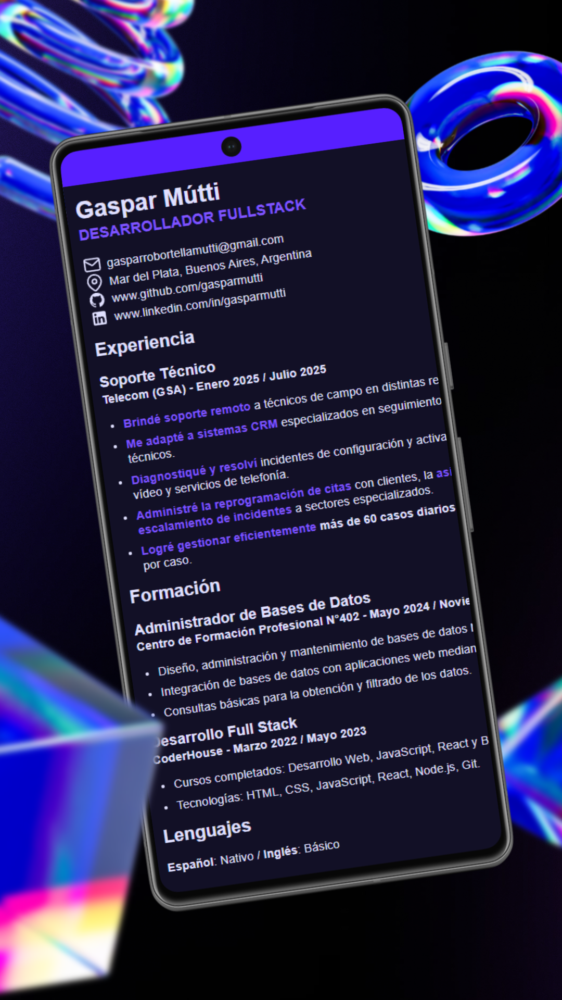
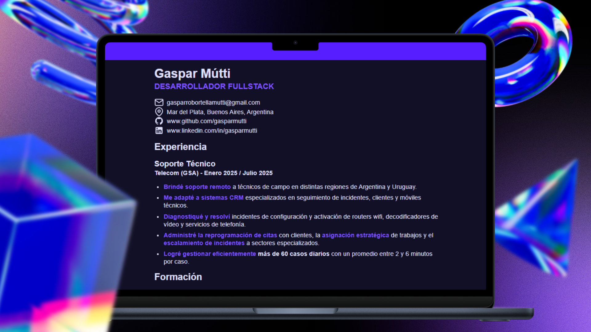

# Currículum de Gaspar Mútti

Este proyecto es un currículum desarrollado con **HTML** y **CSS**, diseñado con un enfoque en:

- **Semántica**: Uso de etiquetas HTML semánticas para mejorar la estructura y comprensión del contenido.
- **SEO**: Optimización para motores de búsqueda mediante metadatos y contenido relevante.
- **Accesibilidad**: Inclusión de atributos y prácticas que mejoran la experiencia para usuarios con discapacidades.
- **Rendimiento**: Diseño eficiente y optimizado para una carga rápida y fluida.

## Tecnologías utilizadas

- **HTML5**
- **CSS3**

## Estructura del proyecto

- `index.html`: Archivo principal que contiene el contenido del currículum.
- `styles/index.css`: Archivo de estilos que define la apariencia del currículum.
- `assets`: Carpeta contenedora de imagenes e iconos.

## Cómo visualizar el proyecto

1. Clona este repositorio en tu máquina local.
2. Abre el archivo `index.html` en tu navegador preferido.

## Capturas de pantalla

